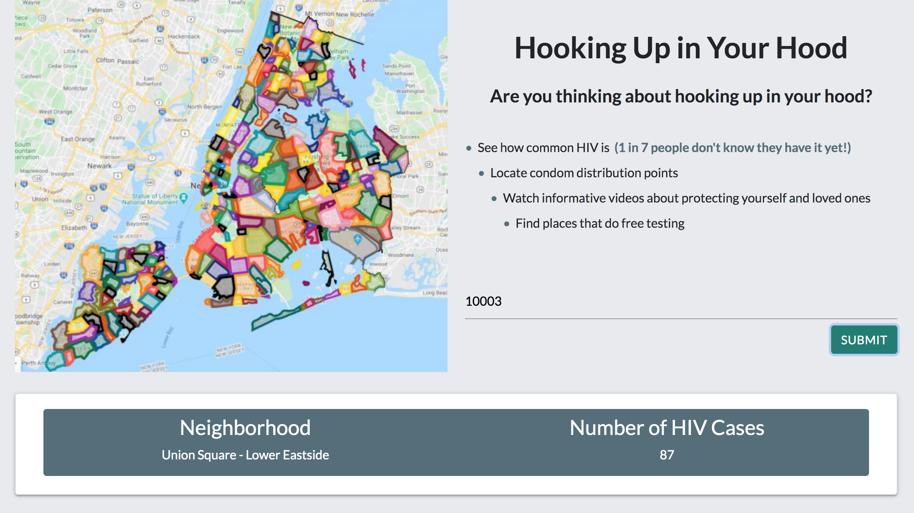
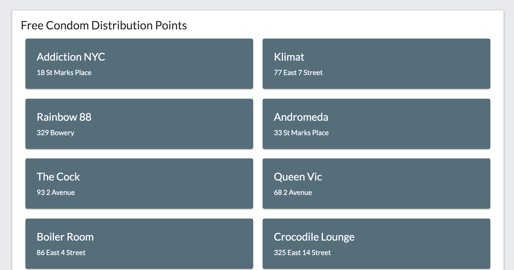
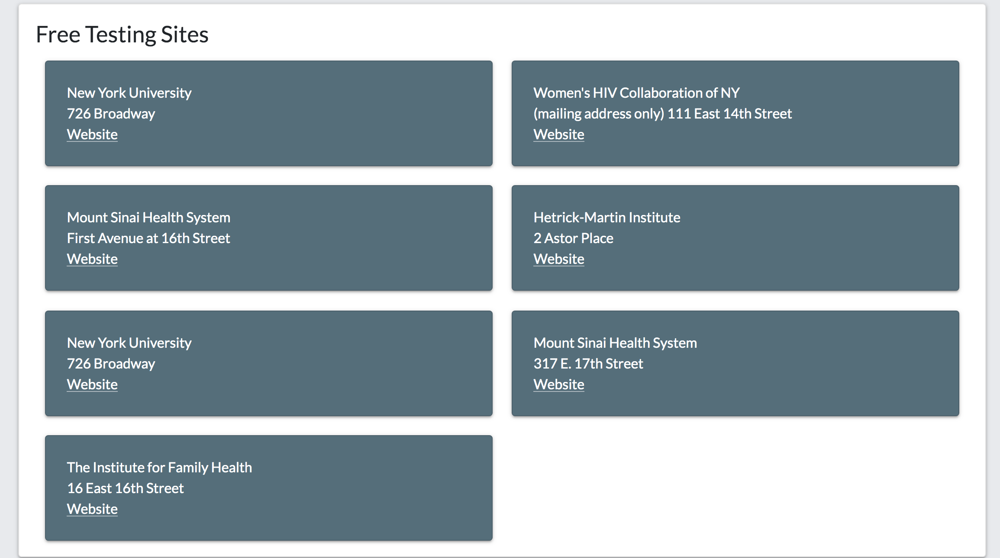

# Unit 7: Hooking Up in Your Hood

A web app that promotes awareness and prevention of HIV, specifically geared toward New Yorkers, with information such as number of HIV cases by neighborhood, free condom distribution sites, informational videos and free testing sites.

------

## Tech/Framework Used

Project is created with:

* NYC OpenData: HIV/AIDS Diagnoses by Neighborhood, Sex, and Race/Ethnicity
(https://data.cityofnewyork.us/Health/HIV-AIDS-Diagnoses-by-Neighborhood-Sex-and-Race-Et/ykvb-493p)
* NYC OpenData: NYC Condom Availability Program
(https://data.cityofnewyork.us/Health/NYC-Condom-Availability-Program-HIV-condom-distrib/4kpn-sezh)
* NYC OpenData: HIV Testing Locations 
(https://data.cityofnewyork.us/Health/HIV-Testing-Locations/72ss-25qh)
* Materialize CSS library (https://materializecss.com/)
* jQuery 3.4.1
* JavaScript

## Usage

The following images demonstrate the application's functionality:

## Contributing

Pull requests are welcome. For major changes, please open an issue first to discuss what you would like to change.

### Step 1

* Option 1:🍴 Fork this repo!

* Option 2: 👯 Clone this repo to your local machine using https://github.com/funksoup/Hooking-Up-in-Your-Hood.git

### Step 2

* HACK AWAY! 🔨🔨🔨

### Step 3

* 🔃 Create a new pull request using https://github.com/funksoup/Hooking-Up-in-Your-Hood/compare

